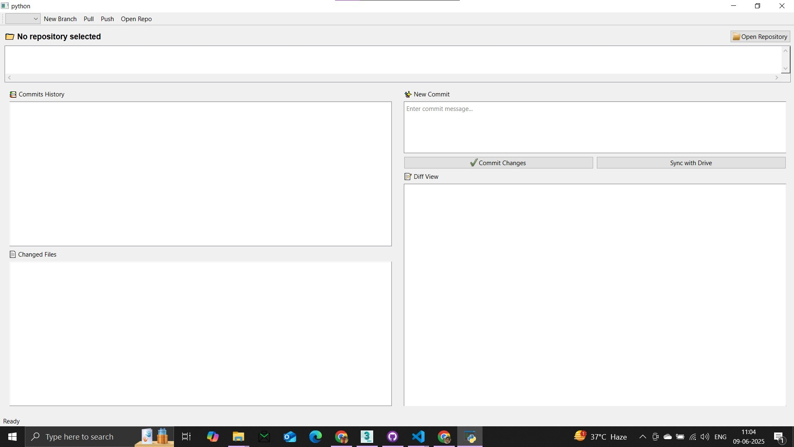

# 🚀 MyGit — A Minimal Git-like Version Control CLI Tool in C++

## 📸 GUI Screenshot

 

## 📌 About the Project

**MyGit** is a custom-built Version Control System (VCS) designed to offer efficient and reliable code and file change management. Drawing inspiration from established VCS tools like Git, this system is engineered from scratch to explore source control mechanisms and ensure high performance.

### 🧠 Architectural Philosophy

- **C** handles the core logic and backend for speed, memory efficiency, and low-level control.
- **Python + PyQt** delivers an intuitive GUI, supporting cross-platform development and rapid prototyping.

> **Note**: The GUI resides in a separate repository during initial development. It will be integrated into a monorepo after reaching maturity.

---

## ✨ Features

### 🔧 C-managed Core & Backend Operations

The C backend powers all low-level and performance-heavy tasks:

- **Repository Initialization**  
  Set up a new VCS repository on disk.

- **Content Addressing (Hashing)**  
  Generate cryptographic hashes (e.g., SHA-1) for content-addressable storage.

- **Object Storage & Retrieval**  
  Manage blobs, trees, and commits efficiently.

- **Diffing & Patching**  
  High-performance algorithms to track and merge changes.

- **Low-Level File System Access**  
  Fast and optimized file manipulation routines.

- **Branch & Tag Management**  
  Create, switch, and delete branches and tags.

- **Index/Staging Area**  
  Track changes selected for the next commit.

- **Minimalist CLI**  
  A basic command-line interface for direct interaction with the VCS.

---

### 🖼️ Python/PyQt-managed GUI Features

The GUI provides a user-friendly interface to interact with the core:

#### ✅ Core VCS Features (UI Side)

- Repository Loading & Initialization  
- Basic Commit History Viewer  
- Changed Files Detection  
- Branch Detection & Switching  
- Commit Message Editor

#### 🧩 UI Components

- Dark Theme Interface  
- Split Panel Layout  
- File Change List Panel  
- Commit History Viewer  
- Commit Graph Visualizer  
- Status Bar for Notifications  
- Branch Selector Dropdown  
- Toolbar with Common Actions

---

### ☁️ Google Drive Integration

- **OAuth2 Authentication**  
- **Credentials Management**  
- **Basic Drive Connectivity**

---

## ⚙️ Getting Started

### ✅ Prerequisites

- **C Compiler**: GCC, Clang, or MSVC  
- **Python 3.x** (e.g., Python 3.8+)  
- **PyQt5** or **PyQt6**

---

### 🧰 Installation

1. **Clone the Repository**

```bash
git clone https://github.com/YourUsername/your-vcs-repo-name.git
cd your-vcs-repo-name
